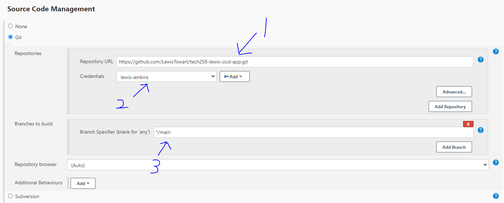

- [CI/CD](#cicd)
  - [What is CI/CD?](#what-is-cicd)
    - [CI](#ci)
    - [CD](#cd)
  - [What is a Webhook?](#what-is-a-webhook)
  - [Why, when and where do we create a CI/CD pipeline?](#why-when-and-where-do-we-create-a-cicd-pipeline)
    - [Nodes](#nodes)
  - [Difference between Delivery and Deployment in prod?](#difference-between-delivery-and-deployment-in-prod)
  - [Jenkins](#jenkins)
    - [What is Jenkins?](#what-is-jenkins)
    - [Why use Jenkins over other tools? (benefits, differences)](#why-use-jenkins-over-other-tools-benefits-differences)
  - [Create a Jenkins Build](#create-a-jenkins-build)
    - [Step 1.](#step-1)
    - [Step 2.](#step-2)
    - [Step 3.](#step-3)
    - [Step 4.](#step-4)
    - [Step 5.](#step-5)
    - [Step 6.](#step-6)
    - [Step 7.](#step-7)
    - [Step 8.](#step-8)
    - [Step 9.](#step-9)
  - [Creating a Github and Jenkins webhook](#creating-a-github-and-jenkins-webhook)
    - [CI](#ci-1)
    - [Step 1.](#step-1-1)
    - [Step 2.](#step-2-1)
    - [Step 3.](#step-3-1)
  - [Jenkins Jobs](#jenkins-jobs)
    - [Job 1](#job-1)
    - [Job 2](#job-2)
    - [Job 3](#job-3)
    - [CD](#cd-1)
    - [Job 4](#job-4)
      - [Notes](#notes)


# CI/CD

## What is CI/CD?


CI/CD stand for continuous integration continuous delivery/deployment

It is the process of automating the steps contained within the software development life cycle; Plan, Design, Develop, Test and Deploy

CI/CD is about automating key aspects of the software development lifecycle, from integrating code changes to deploying them to production. It helps teams deliver high-quality software more efficiently by reducing manual effort, speeding up feedback loops, and increasing deployment frequency.

### CI

This involves automatically building and testing code changes frequently, typically multiple times a day or whenever changes are pushed to the version control repository. The goal of CI is to catch integration errors early in the development process, ensuring that new code additions don't break the existing codebase.

### CD

This is the process of automatically deploying code changes to production or staging environments after they pass through the CI pipeline. The goal of CD is to streamline the deployment process, making it fast, reliable, and repeatable. With continuous deployment, code changes can be released to users quickly and frequently.

## What is a Webhook?

A webhook is a mechanism for automatically triggering an action or notifying an external system when a certain event occurs.

An example of this would be on Amazing when you add an item to the basket it is checking first is that item in stock? If yes allow the item to be added to the basket. Then at the payment stage has the payment gone through? If yes send an email to notify the user of this. Has the item then been sent out for delivery? If yes notify the user that their item is on it's way.

A webhook is what allows all of these actions to me automated without this it wouldn't feasibly be possible for someone to do this for the billions of orders amazon gets each year.

## Why, when and where do we create a CI/CD pipeline?


A CI/CD pipeline is present in every role containing DevOps and is one of the core principles. This is because implementing a CI/CD allows you to release software faster. In turn this saves time doing these steps manually and it also saves money.

This process also allows for a consistent feedback loop. At the testing stage if something is wrong with the code such as a function being missing a log will be created. This log can then be sent back to the development team for them to fix.

### Nodes

We are going to use a Jenkins master node which will be responsible for the automatic deployment of our code assuming it passes testing. This tells the agent node to do the tests and the log file can be accessed from here.

We are also going to use a Jenkins agent node that will responsible for that testing and creating the log file. If any issues arise this log file can be looped back for the developers to fix.

## Difference between Delivery and Deployment in prod?

When the new code has been tested and is ready to be sent into the production environment you can either deliver this or deploy it.

If you were to deliver the new code it will not be live for the user to have access to. You would need to manually do this yourself by going into the app and doing npm start for example to get it running.

As for deployment this can be done automatically within the CI/CD pipeline with Jenkins. The code will be deployed and would be live within the prod environment with users being able to access it. This could be something along the lines of a new feature or bug fix.

A real life example would be when a movie has released they are delivered to the cinema weeks before they are actually airing. This can be helpful to check if there are any unforeseen issues with them. When the time comes they will then say this movie is airing come and see if so the user/member of the public can come and watch the film.

http://3.9.14.9:8080/login?from=%2F

## Jenkins

### What is Jenkins?

Jenkins is a very powerful open source automation server. It can automate the process of building, testing and deploying software which enables teams to quickly and reliably deliver software.

### Why use Jenkins over other tools? (benefits, differences)


## Create a Jenkins Build

We are going to be working with Jenkins an open source automation server. I am going to be automating the process of testing our sparta app every time something new has been pushed to the associated git repo https://github.com/LewisTowart/tech258-lewis-cicd-app/tree/main

### Step 1.

Login using the below link.

http://3.9.14.9:8080/login?from=%2F

### Step 2.

Click on new item and select free style project. Name it something sensible like lewis-ci then click okay.


### Step 3.

Now continue down to Office 365 Connector and select restrict where this project can be run. Then in the search box look for sparta-ubuntu-node. You will want to delete the empty space at the end and select the option again for a second time.


### Step 4.

Move down to Source code management and select git. Here you want to add the http link from your git repo into the repository URL box.


You will also need to links the correct credentials mine being lewis-jenkins.

Change the branch specifier to main which is where the app is located.



### Step 5.

Moving onto build triggers this is where we are automating the response form the webhook. You are going to want to follow the step in the webhook section and then return to this part. Now select the box that says Github hook trigger.


### Step 6.

Now scrolling down to build environment we want to select the tick box for provide node and npm bin. This is so that node will be installed on our virtual machine.


### Step 7.

Next we are adding in the build section, click the add option and select execute shell. The below code need to go in the command box to test the app.


```
cd app
npm install
npm test
```


### Step 8.

Now you can click save to move to the next screen.

Here we want to first manually test our build by clicking the build now option. If everything has worked you should see a #1 with a blue dot next to it to indicate a success with no issues.


You can check this by click the arrow next to the #1 which appears when you hover over it and selecting console output.


### Step 9.

To test that our webhook is working we need to make a change to our local repo that is associated with out Jenkins build.

Once we have made this change push the new changes to the remote repo on github

If done correct similar to before a #2 build should appear on the Jenkins UI and should also have a successful blue dot next to it.

You can go to your github repo and into the webhook setting. Click on edit for the webhook you have set up then into recent deliveries to see what's been happening as well.


## Creating a Github and Jenkins webhook

### CI

### Step 1.

First we are going to head over to our github repo that we want to associate the webhook with.

Once we are there we are going to click on settings. (check image in step 2)

### Step 2.

In this list we can see webhooks on the left side click on this option. Next you want to click on the option near the top right that says add webhook.


### Step 3.

In the payload URL box you are going to want to paste the link of your build/Jenkins environment URL with /github-webhook/ at the end. An example link can be seen below.

http://3.9.14.9:8080/github-webhook/

Finally you are going to want to select when you want this webhook to trigger in this case just select push event for now. Also select the box that says active to deliver event details when the hook is triggered.


You can now return to creating your Jenkins build as the webhook will be associated with it if you've used the corresponding link.

## Jenkins Jobs

Jenkins is able to complete jobs similar to the one setup earlier and then create a build action. This is when one job is complete and was successful it can then start another job. In this process we are going to automate the steps from the push of new code to the deployment of the app automatically..

.png>)

### Job 1


I need to create a Dev branch for the app, make a change locally and test that the job completed.

I have created a new dev branch by using the below command

```
git checkout -b dev
```

I can now follow my job build from earlier but using */dev now.

### Job 2


If the job completes have a new job to merge that new app code on the dev branch with old code on the main branch

I first had to create a new job I called it lewis-ci-merge

I then did the office 365 coneected sparta-ubuntu-node

In source code management I selected git used the ssh link git@github.com:LewisTowart/tech258-lewis-cicd-app.git

We're focusing on the */dev brnach

I added a additional behaviour, the name is origin, branch is main, default then --ff

Post build 

### Job 3

Now we need to get the main branch of code and push it to the production environment.

- Create an EC2 instance with Ubuntu 18.04LTS
- Ensure that I allow the ports for Jenkins 8080 and SSH 22 into the prod env
- For Jenkins to access the EC2 I need to use the tech258.pem file on the SSH Agent
- I then need the job to clone the app code over from the main repo
- Now I need to SSH into the instance to see if the job has been successful and the newly merged app code is present
- Next I need to now prepare the dependencies for the app to run update, upgrade, nginx?, node.js, pm2?

### CD

### Job 4

This job now needs to be able to deploy the app and run it automatically

- I'm going to need port port 80 http and 3000 open for now while testing but I do have the reverse proxy code available
- I need to ssh into the app and test the deployment manually as I need the app to start in the background as to not timeout jenkins and lock the console
- I could use pm2 but I need to see what the code was to run in the background I believe it was just one symbol after the run command
- When I've tested it I should be able to basically use my script from running the app


#### Notes

create a branch if tests pass merge with main

branch dev using git, git checkout dev
make a change locally, push to git hub if tests passed
trigger the next job to merge the code from dev to main in your repo
second job should be triggered automatically if the tests passed

what os jenkins on in desk

build
execute shell

```
uname -a
```
add post build
build other projects
timezone pro
stable


timezone check
find timezone jenkins server
shell

```
date
```

need to be in dev branch for ci
lewis-ci-merge into main

third job get the code from main and push it to production
- create ec2 first with ubuntu 18.04LTS
- aws will ask jenkins if it has the ssh to log in .pem file on jenkins
- when we ssh in we have to manually say yes to the fingerprint
- copy the new code from jenkins to the prod env (manually check and launch (logo change))
- 
- install required dependencies  nginx, node.js,
- cd app
- npm install
- npm start

errors - port 22 isnt open - SG required didn't allow jenkins for port 8080
automate the process of yes to fingerprint on ssh
copy code is it copied ssh in confirm
then manually npm install and npm start
22 ssh, 8080 jenkins, 3000 node.js, 80 http

add to ci job ssh agent to get the key for aws (Dan has done)

create 4th job in jenkins to deploy the app - run it automatically 
don't run npm start use in background or will timeout jenkins

Avoid using git commands in the execute shell

need a diagram explaining the process

What if the test isn't successful, could delete the sparta js and it will fail and not trigger the next job